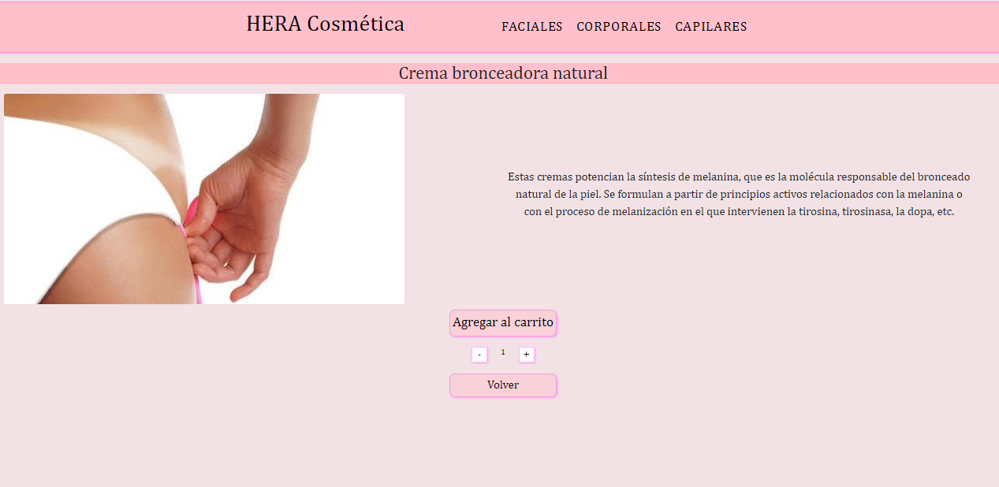
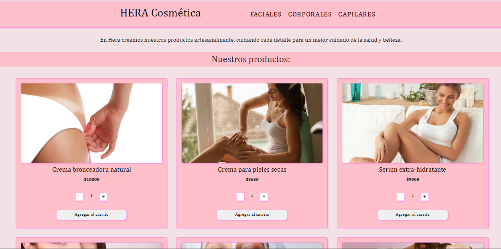
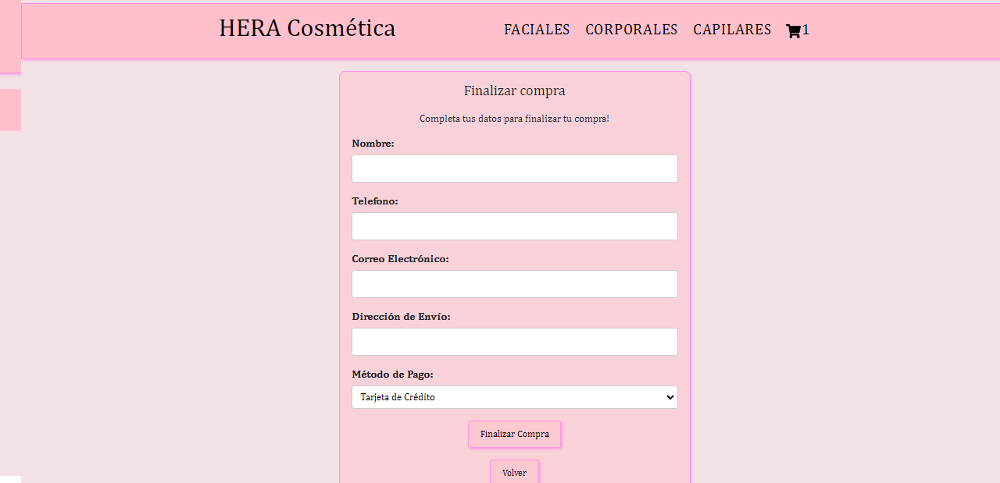
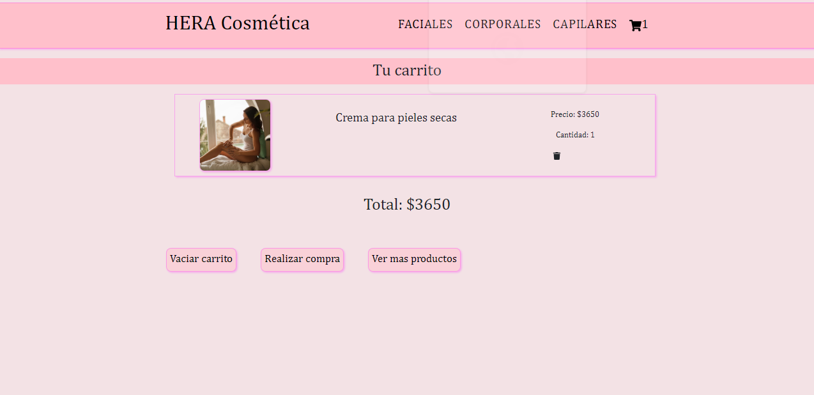
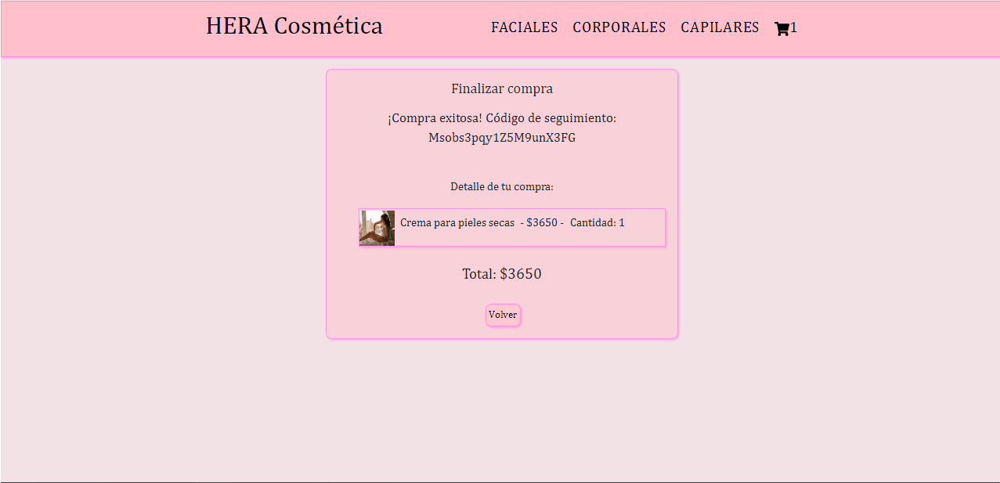

# HERA Cosmetica

HERA Cosmetica is an ecommerce that offers beauty and feminine care products for sale.

## Tabla de Contenidos

1. [Description](#description)
2. [Screenshots](#screenshot)
3. [Characteristics](#characteristics)
4. [Demo](#demo)
5. [Requirements](#requirements)
6. [Installation](#installation)
7. [Use](#use)
8. [License](#license)

## Description

This ecommerce offers women's facial, body and hair care products for sale. It has a main page with all the products, and the option to filter by categories in the navigation bar.

## Screenshot

## Characteristics

- Catalog of hair, body and facial products.
- Filtering products by categories
- Shopping cart and payment process.
- User registration and authentication.
- Generation of orders and management of products in Firebase.

## Demo

Click on the link to see the demo.

[See the demo](public/video/demo.webm)

## Requirements

Before you start working on this project, make sure you meet the following requirements:

- **Node.js y npm:** You must have Node.js installed on your system. You can download it from [nodejs.org](https://nodejs.org/).

- **Git:** It is recommended to have Git installed to manage version control of your project. You can download it from [git-scm.com](https://git-scm.com/).

## Installation

Follow these steps to install and run the app:

1. Clone this repository to your local machine using Git: git clone https://github.com/Florencia-Harmath/hera-react.git.
2. Navigate to the project directory: cd hera-project.
3. Install the project dependencies using npm: npm install.
4. Start the application: npm run dev.
The application should be available on localhost, in your web browser.

## Use

The main section of the page has a list of all the products that the company offers, brought from the firebase database, firestore. The data for its use is found in the .env file, which is located in gitignore to protect sensitive data, the photos are saved in the project, in the public/img folder. The page has a navigation bar, where you have the options to filter products by category, "Faciales", "Capilares" and "Corporales", the navigation bar also has a brand with the name of the venture, which when clicked takes you to the main page, all links created with react-router-dom. Each productCart has the image, the price, the add to cart button with a counter that allows you to add more than one product without exceeding the stock limit, and the name of each product, which is a link that when clicked takes you to the description of each one in particular, where the product detail appears, and the option to add it to the cart as in the productCart. To add the products, click the "Agregar al carrito" button, toastify was used to notify the added product. When adding products to the cart, the cart widget appears in the navbar with the number of products added, their description, their price and the total, it also has the option to delete the product, or delete one product at a time if there are more, with the trash can (react-icons). The cart has three buttons, "vaciar carrito", "ver mas productos" and "realizar compra". Once the desired products have been selected, click on "realizar compra" where there is a form with mandatory data that the customer must fill out and select the method. payment, once made, a sign is displayed that says that the purchase was successful, the purchase detail is shown and a tracking code is the ID of the order that is generated in Firebase at the end. 

## License

This is a project for educational purposes, so it does not have commercial functionality, nor does it offer sensitive data. All products are fictitious, cannot be used for commercial purposes.

